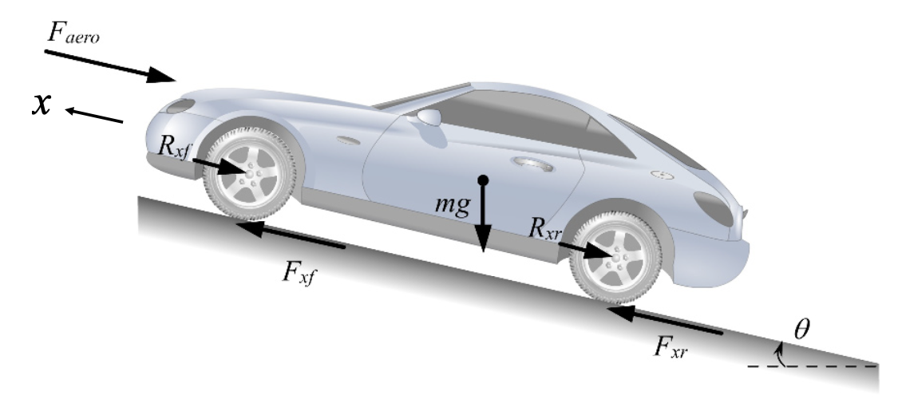
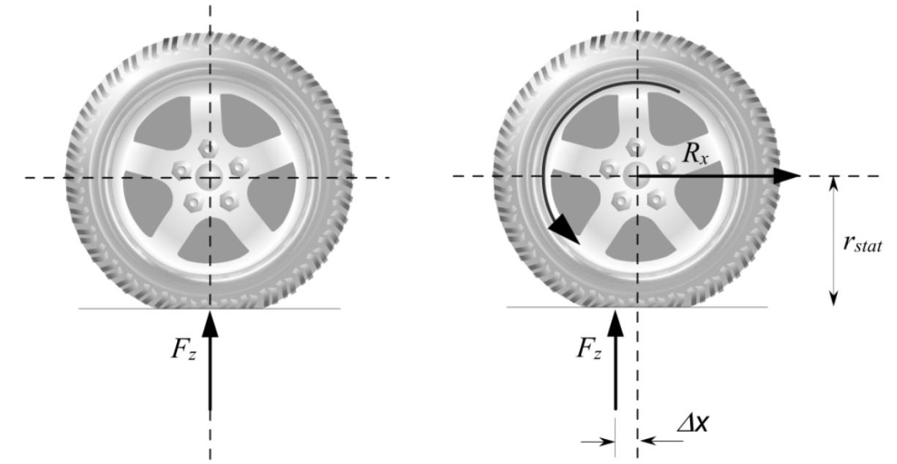
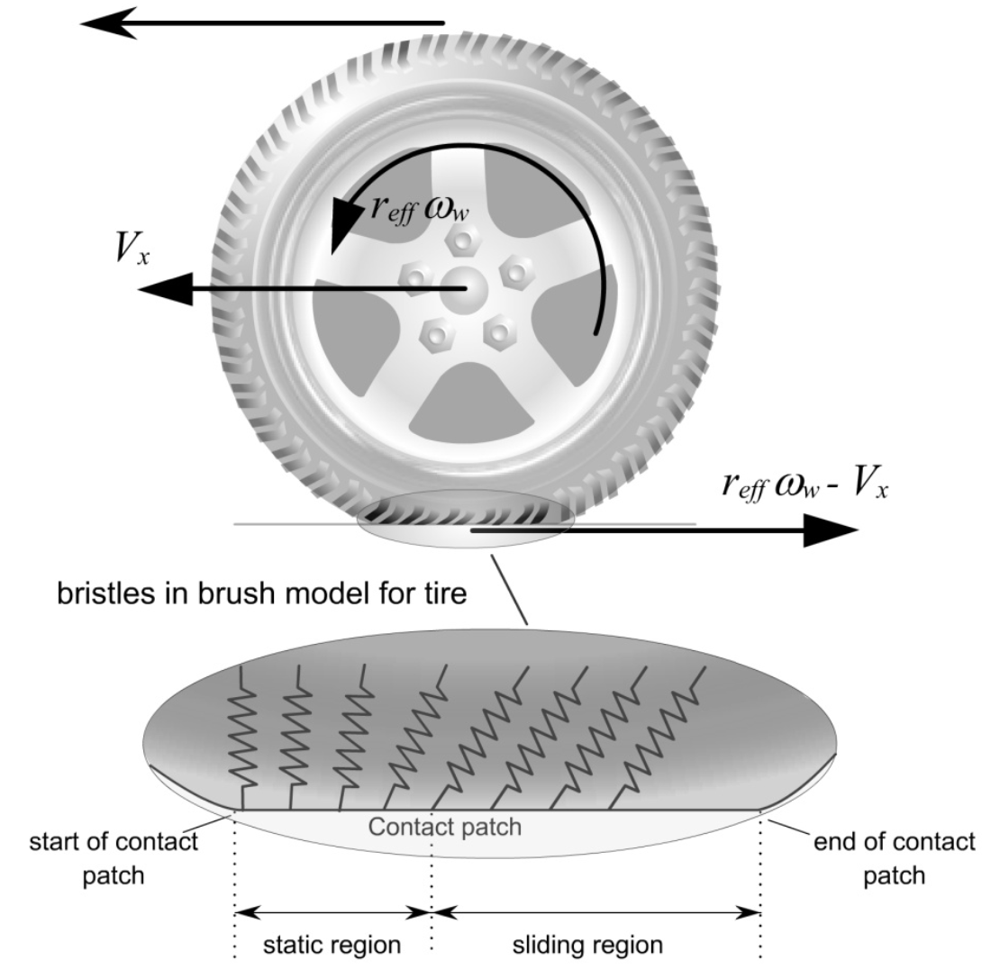
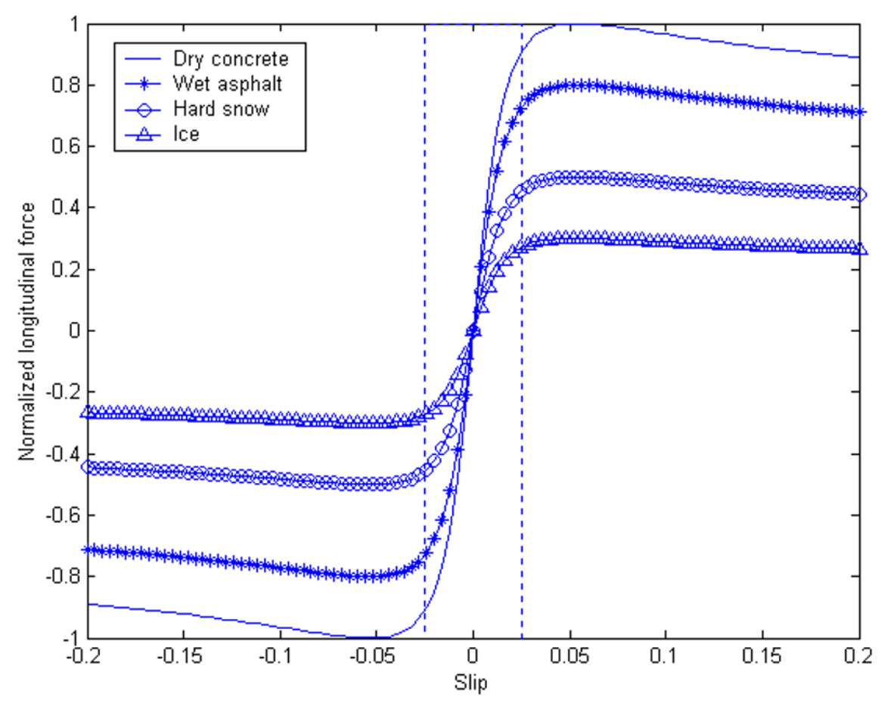
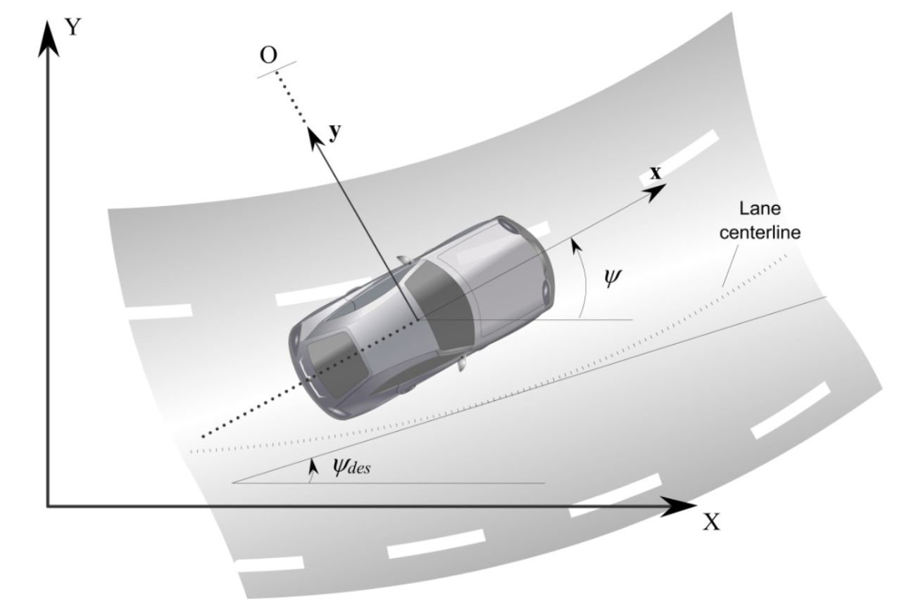
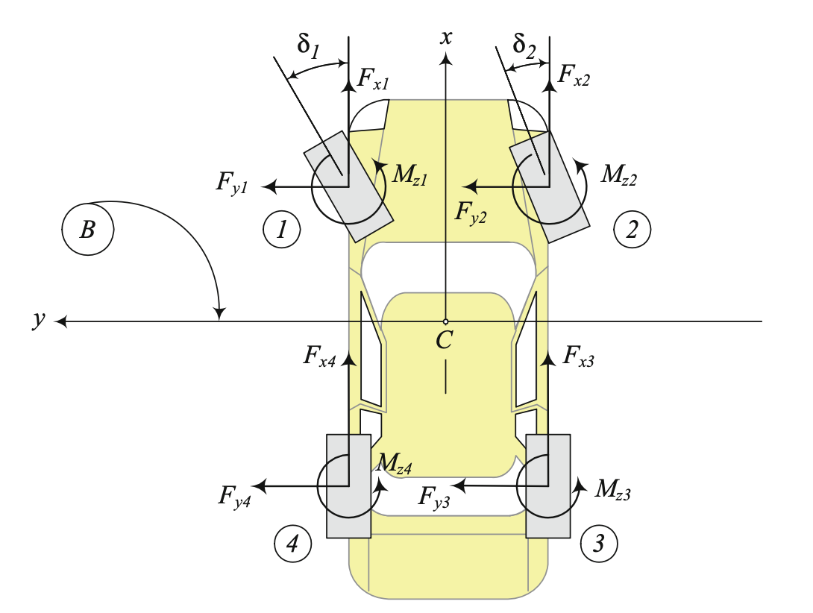
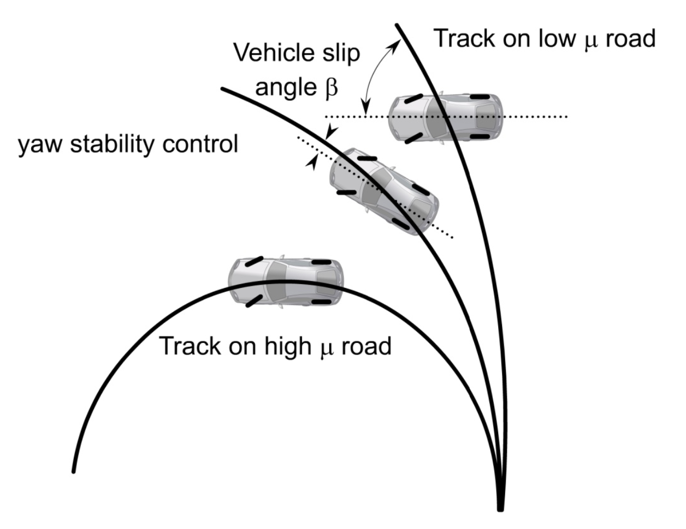

# Self-Driving Car

The repository presents the results of a research project implemented in the framework of scientific collaboration with [Arrival](https://arrival.com/world/en). The global objective of the research is to investigate the ability of using Reinforcement Learning (RL) for solving various problems concerned with Self-Driving Car. The car model, provided by Arrival, describes the dynamics of a real car in detail and, in particular, takes into account the tire models described the forces in the road-tire interactions according to the dynamic condition of the vehicle. The repository describes only the results of experiments, but does not include the model itself. 

**Implementation:** Vitaly Kalev, Aleksandr Goranov, Anton Plaksin

**Advisors:** Vladimir Bulaev

## Motivation

A variety of driver assistance systems are being developed by automotive manufacturers to automate mundane driving operations, reduce driver burden and thus reduce highway accidents. Examples of such driver assistance systems under development include

1. collision avoidance systems which automatically detect slower moving preceding vehicles and provide warning and brake assist to the driver

2. adaptive cruise control (ACC) systems which are enhanced cruise control systems and enable preceding vehicles to be followed automatically at a safe distance

3. lane departure warning systems

4. lane keeping systems which automate steering on straight roads

5. vision enhancement night vision systems

6. driver condition monitoring systems which detect and provide
warning for driver drowsiness, as well as for obstacles and pedestrians

7. safety event recorders and automatic collision and severity
notification systems

These technologies will help reduce driver burden and make drivers less likely to be involved in accidents. This can also help reduce the resultant traffic congestion that accidents tend to cause.

## Dynamic model

In general, the car dynamics can be divided into two motion types:

1. longitudinal motion, where the main task is to maintain the required speed;

2. lateral motion, where the main task is to maintain the desired direction.

### Longitudinal vehicle movement

The external longitudinal forces acting on the vehicle include aerodynamic drag forces, gravitational forces, longitudinal tire forces and rolling resistance forces.

 

 

A force balance along the vehicle longitudinal axis yields

$m \ddot{x} = F_{xf} + F_{xr} - F_{aero} - R_{xf} - R_{xr} - mg$

where

$F_{xf}$ is the longitudinal tire force at the front tires;

$F_{xr}$ is the longitudinal tire force at the rear tires;

$F_{fz}$ is normal force on forward tires;

$F_{rz}$ is normal force on rear tires;

$F_{aero}$ is the equivalent longitudinal aerodynamic drag force;

$R_{xf}$ is the force due to rolling resistance at the front tires;

$R_{xr}$ is the force due to rolling resistance at the rear tires;

$m$ is the mass of the vehicle;

$g$ is the acceleration due to gravity.

The longitudinal tire forces $F_{xf}$ and $F_{xr}$ are friction forces from the ground that act on the tires.

Experimental results have established that the longitudinal tire force generated by each tire depends on the normal (vertical) force on the tire, the slip ratio and the friction coefficient of the road surface.

The vertical forces on a tire is called the tire vertical load. The vertical load on a tire

1. comes from a portion of the weight of the vehicle
2. is influenced by fore-aft location of the c.g., vehicle longitudinal acceleration, aerodynamic drag forces and grade of the road.

 

Let the longitudinal velocity at the tire under consideration be  $V_{x} $ and the equivalent rotational velocity of the tire be  $r_{eff} \omega_{w} $ where  $r_{eff} $ is the effective radius of the tire and  $\omega_{w} $ is the angular velocity of the wheel. Then the longitudinal slip ratio of the tire is defined as

$\sigma_{x} = \frac{r_{ef} \omega_{w} - V_{x}}{V_x}$ during braking

$\sigma_{x} = \frac{r_{ef} \omega_{w} - V_{x}}{r_{ef} \omega_{w}}$ during acceleration

 

Coefficient of friction, ratio of the frictional force resisting the motion of two surfaces in contact to the vertical force pressing the two surfaces together. 

 

As can be seen from the figure below, in the case where longitudinal slip ratio is small (typically less than 0.1 on dry surface), as it is during normal driving, the longitudinal tire force is found to be proportional to the slip ratio.

### Lateral vehicle movement

Such a model provides a mathematical description of the vehicle motion without considering the forces that affect the motion. The equations of motion are based purely on geometric relationships governing the system.

 

 

Vehicle stability control systems that prevent vehicles from spinning and drifting out have been developed and recently commercialized by several automotive manufacturers. Such stability control systems are also often referred to as yaw control systems or electronic stability control systems.

Figure below schematically shows the function of a yaw control system. In this figure, the lower curve shows the trajectory that the vehicle would follow in response to a steering input from the driver if the road were dry and had a high tire-road friction coefficient. In this case the high friction coefficient is able to provide the lateral force required by the vehicle to negotiate the curved road. If the coefficient of friction were small or if the vehicle speed were too high, then the vehicle would be unable to follow the nominal motion required by the driver – it would instead travel on a trajectory of larger radius (smaller curvature), as shown in the upper curve of Figure. The function of the yaw control system is to restore the yaw velocity of the vehicle as much as possible to the nominal motion expected by the driver. If the friction coefficient is very small, it might not be possible to entirely achieve the nominal yaw rate motion that would be achieved by the driver on a high friction coefficient road surface. In this case, the yaw control system would partially succeed by making the vehicle’s yaw rate closer to the expected nominal yaw rate, as shown by the middle curve in Figure.

 

Thus, forces and moments from the road act on each tire of the vehicle and highly influence the dynamics of the vehicle. If the longitudinal slip ratio is not small or if the road is slippery, then a nonlinear tire model needs to be used to calculate the longitudinal tire force named The Pacejka “Magic Formula” model. Therefore most algorithms of car control systems use information about the tire-road friction coefficient named $\mu$ and tuned to work with dry, wet or icy coating and having information about this coefficient value allows to subsequently cost control in a more effectively. 

## Tasks

### Task 1 $\mu$ parameter estimation

The problem can be formalized as one-step Markov Decision Process (MDP) $ (A,R) $.  Here  $A = [ \mu_{min}, \mu_{max} ] $ is the interval of admissible values of $\mu$ and 

$R = \int\limits_0^1\bigg( \sum\limits_{i \in I} |\hat{x}_i(t) - x_i(t)|\bigg) d t$

is the reward function, where  $I $ is the set of indexes of observed coordinates,  $\hat{x} $ is the realized motion of the car with unknown  $\hat{\mu} $, and  $x_i $ is the motion of the car model dependent on choice of  $\mu $. We aims to find  $\mu_0 $ such that  $R = 0 $  and verify the equality  $\mu_0 = \hat{\mu} $.

To solve the problem, we use cross-entropy method (CEM). Its parameters and other details of the experiment can be found in ???.

### Task 2 $\mu$ parameter estimation for an disturbance car model

Since a real car and its model can be different, it is important to study the stability issue of the algorithm performance iwth respect to the car parameters (such as length, mass, tire parameters, etc.).

### Task 3 Finding the best rear wheel traction to get through the straight line segment as quickly

### Task 4 Finding the best rear wheel traction to get through the circle segment as quickly

## References

1. Rajesh Rajamani, "Vehicle Dynamics and Control", Mechanical Engineering Series,  2012.
