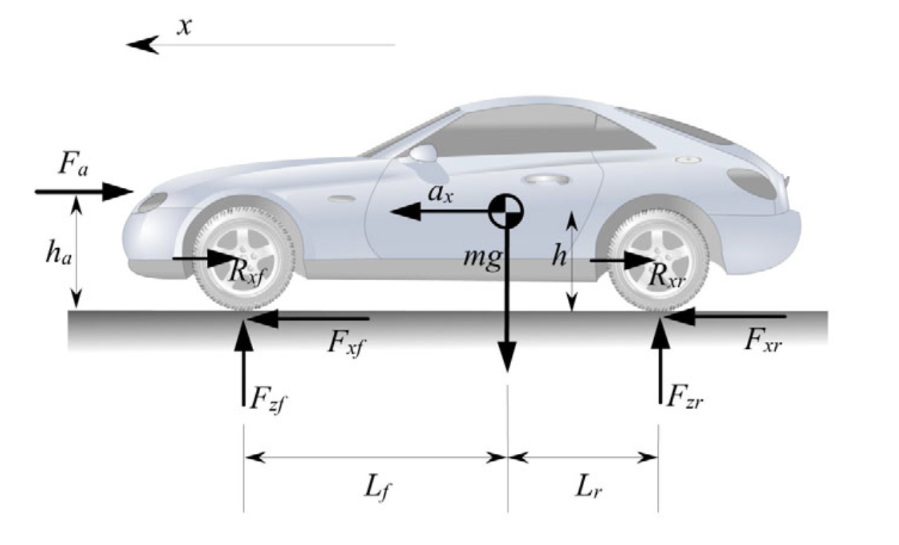
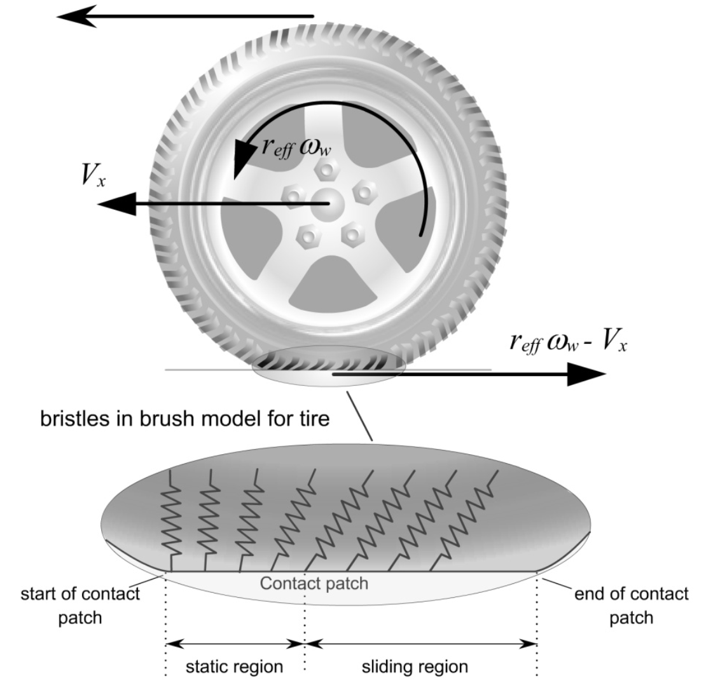
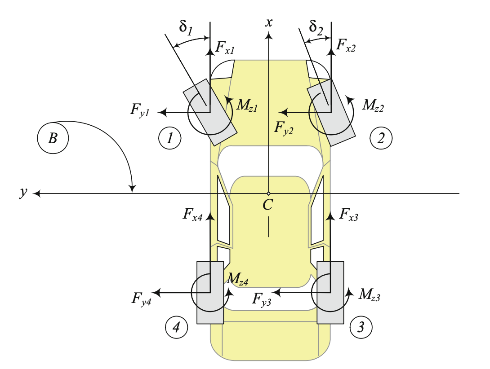

# Self-Driving Car

The repository presents the results of a research project implemented in the framework of scientific collaboration with [Arrival](https://arrival.com/world/en). The global objective of the research is to investigate the ability of using Reinforcement Learning (RL) for solving various problems concerned with Self-Driving Car. The car model, provided by Arrival, describes the dynamics of a real car in detail and, in particular, takes into account the tire models described the forces in the road-tire interactions according to the dynamic condition of the vehicle. The repository describes only the results of experiments, but does not include the model itself. 

**Implementation:** Vitaly Kalev, Aleksandr Goranov, Anton Plaksin

**Advisors:** Vladimir Bulaev

## Dynamic model

In general, the car dynamics can be divided into two motion types: **longitudinal motion**, where the main task is to maintain the required speed; **lateral motion**, where the main task is to maintain the desired direction.

### Longitudinal motion

The external longitudinal forces acting on the vehicle include aerodynamic drag forces, gravitational forces, longitudinal tire forces and rolling resistance forces.

 

A force balance along the vehicle longitudinal axis yields

$m \ddot{x} = F_{xf} + F_{xr} - F_{aero} - R_{xf} - R_{xr} - mg$,

where $F_{xf}$ and $F_{xr}$ are the longitudinal tire force at the front and rear tires; $F_{fz}$ and $F_{rz}$ are normal force on forward and rear tires; $F_{aero}$ is the equivalent longitudinal aerodynamic drag force; $R_{xf}$ and $R_{xr}$ are the force due to rolling resistance at the front and rear tires; $m$ is the mass of the vehicle; $g$ is the acceleration due to gravity.

Experimental results have established that the longitudinal tire force generated by each tire depends on the normal (vertical) force on the tire, the slip ratio $\sigma_x$ and the friction coefficient $\mu$ of the road surface.

The vertical forces comes from a portion of the weight of the vehicle which is influenced by fore-aft location of the c.g., vehicle longitudinal acceleration, aerodynamic drag forces and grade of the road.

Let the longitudinal velocity at the tire under consideration be  $V_{x}$ and the equivalent rotational velocity of the tire be  $r_{eff} \omega_{w}$ where  $r_{eff}$ is the effective radius of the tire and  $\omega_{w}$ is the angular velocity of the wheel. Then the longitudinal slip ratio of the tire is defined as

$\sigma_{x} = \frac{r_{ef} \omega_{w} - V_{x}}{V_x}$ during braking

$\sigma_{x} = \frac{r_{ef} \omega_{w} - V_{x}}{r_{ef} \omega_{w}}$ during acceleration

 

Coefficient of friction $\mu$, ratio of the frictional force resisting the motion of two surfaces in contact to the vertical force pressing the two surfaces together. 

### Lateral motion

Such a model provides a mathematical description of the vehicle motion without considering the forces that affect the motion. The equations of motion are based purely on geometric relationships governing the system.

 

The forces and moments from the road act on each tire of the vehicle and highly influence the dynamics of the vehicle. Thus the lower curve  in Figure below shows the trajectory that the vehicle would follow in response to a steering input from the driver if the road were dry and had a high tire-road friction coefficient. In this case the high friction coefficient is able to provide the lateral force required by the vehicle to negotiate the curved road. If the coefficient of friction were small or if the vehicle speed were too high, then the vehicle would be unable to follow the nominal motion required by the driver – it would instead travel on a trajectory of larger radius (smaller curvature), as shown in the upper curve of Figure. If the friction coefficient is very small, it might not be possible to entirely achieve the nominal yaw rate motion that would be achieved by the driver on a high friction coefficient road surface.

 

In the case when the longitudinal slip ratio is not small or if the road is slippery, then a nonlinear tire model needs to be used to calculate the longitudinal tire force named The Pacejka “Magic Formula” model. Therefore most algorithms of car control systems use information about the tire-road friction coefficient named  and tuned to work with dry, wet or icy coating and having information about this coefficient value allows to subsequently cost control in a more effectively.

## Problems

### Problem 1. $\mu$ parameter estimation

The problem can be formalized as one-step Markov Decision Process (MDP) $(A,R)$.  Here  $A = [ \mu_{min}, \mu_{max} ]$ is the interval of admissible values of $\mu$ and 

$R = \int\limits_0^1\bigg( \sum\limits_{i \in I} |\hat{x}_i(t) - x_i(t)|\bigg) d t$

is the reward function, where  $I$ is the set of indexes of observed coordinates,  $\hat{x}$ is the realized motion of the car with unknown  $\hat{\mu}$, and  $x_i$ is the motion of the car model dependent on choice of  $\mu$. We aims to find  $\mu_0$ such that  $R = 0$  and verify the equality  $\mu_0 = \hat{\mu}$.

To solve the problem, we use cross-entropy method (CEM). Its parameters and other details of the experiment can be found in ???.

### Problem 2. $\mu$ parameter estimation under data perturbation

Since a real car and its model can be different, it is important to study the stability issue of the algorithm performance with respect to the car parameters (such as length, mass, tire parameters, etc.). Within our experements, we fix $\mu$, control actions, and initial points, but perturb all parameters of the car model by 10%. We make 10 runs. The results of the algorithm are shown in the graph below.

Blue line shows true $\mu$. Red points demonstrate the results of the algorithm, when algorithm works with the perturbed car models. Green points demonstrate the results of the algorithm, when algorithm works with the fixed car model, but $\mu$ is substituted into the perturbed model. 

The results show the algorithm gets values quite close to the true $\hat{\mu}$ which says about its stability.

### Problem 3. Time-optimal problem on a straight line segment

Let us fix a car model, $\mu$ parameter, and a straight line segment. Our aim is to find control actions that provides the fastest possible finish of the car model. 
We fix a paritition of the control interval and fomalize the problem as a MDP $(s_0,S,A,R,S_T)$ in which $s_0$ is the initial state, $S\$ and $A$ are the state and  action spaces, $P$ is the transition function determined by the car model, its dynamic, and the partition, $R = - \Delta t$ is the reward function, where $\Delta t$ is the partition step, $C$ is the stop criterion defined as 

$$
\sum\limits_{i=0}^t \dot{x}(i \Delta t) \Delta t > L,
$$

i.e. we stop the motion when the car has passed the segment.

We also use CEM algorithm. Its results are presented below. 

The figure shows that the algorithms steadily converges to **8.6sec**. In order to check the optimality of this value, look at the following figure:

This figure shows the dependence of force on $\sigma$. It is known that the optimal control provides $\sigma$ such that the maximum of this graph is achieved. In our experiment, we obtain $\sigma$ that coincides quite closely with the optimal. This gives us additional confidence to say that the found control is optimal.

### Problem 4. Time-optimal problem on a circle segment

This problem is similar to previous one, but, in this case, the car must go through the turn as fast as possible. Moreover, the car must not drive inside a circle of a certain radius. To ensure this, we put the reward $R = - 2 \Delta t$ if the car inside the circle. The obtained trajectories for half, 3/4, and full segment of  the circle are presented below:

The fastest time for a half circle is **4.3s**, for 3/4 segment is **6.2s**, and for full circle is **7.1s**.

## References

1. Rajesh Rajamani, "Vehicle Dynamics and Control", Mechanical Engineering Series,  2012.
